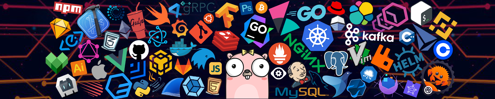

<!-- Banner Image -->

  

<!--  Profile Views Counter-->

 
  

<!-- Introduction Header with Typing Animation -->
<h1 align="center">Assalamu Alaikum!  I'm M. Talha Farooqi </h1>

  

<table>
  <tr>
    <td width="68%" valign="top">
      <h3>About Me</h3>
      

        <b>Full-Stack Developer</b> experienced in building modern and scalable web and mobile applications.
      

      

        Working with <b>Artificial Intelligence</b>, <b>Machine Learning</b>, <b>Deep Learning</b>, and <b>Computer Vision</b>.
      

      

        Experienced with the <b>MERN Stack</b> and end-to-end application development.
      

      

        <b>Computer Vision Researcher</b> focused on applying research to practical, real-world systems.
      

      

        Exploring <b>Generative AI</b>, <b>Agentic AI</b>, and intelligent automation.
      

      

        Interested in <b>Data Structures & Algorithms</b>, problem-solving, and production-ready software development.
      

    </td>
    <td width="32%" align="center" valign="middle">
      
    </td>
  </tr>
</table>

<h2 align="left">🛠️ &nbsp;Technologies I Work With</h2>

  
   
  
   
  
   
  

<!-- <h2 align="left">📜 &nbsp;My Articles</h3>

 -->

<h2 align="left">🎧 &nbsp;Now Playing On Spotify</h2>

  

</align>

    
    
    
     
    
    
    
    
    
    
    
      
    
    
        
    
      
      

<!-- Problem in Fetching. I will fix it later. InshaAllah :)

   GitHub Stats 
  
   Streak Stats 
  
  Most Used Languages
  

 
-->
<!-- Connect With Me Section -->
<h2 align="left">🤝 Connect With Me</h2>

<!-- Social Media Icons -->

  
  
  
    

<!-- Snake Game Eating My Contribution Graph -->

  

## 💖 Support My Work

Thank you for stopping by my corner of GitHub! 🌟  

  

