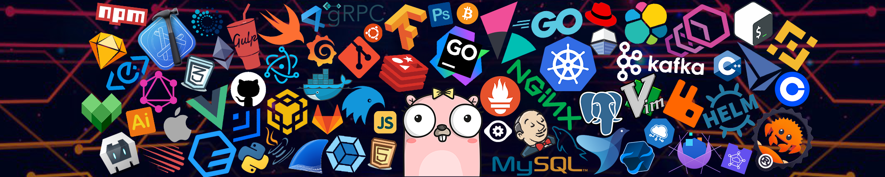

<!-- Banner Image -->

  

<!--  Profile Views Counter-->

 
  

<!-- Introduction Header with Typing Animation -->
<h1 align="center">Assalamu Alaikum!  I'm M. Talha Farooqi </h1>

  

 <>

<h2 align="left">🛠️ Technologies I Work With</h2>

  
   
  
   
  
   
  

<!-- Snake Game Eating My Contribution Graph -->

  

<!-- Problem in Fetching. I will fix it later. InshaAllah :)

   GitHub Stats 
  
   Streak Stats 
  
  Most Used Languages
  

 
-->
<!-- Connect With Me Section -->

  <ul align="left">
    
<h2 style="display: inline-block">Connect With Me 🤝</h2>

  </ul>

<!-- Social Media Icons -->

  
  
  
    

### ✍️ Random Dev Quote

  
